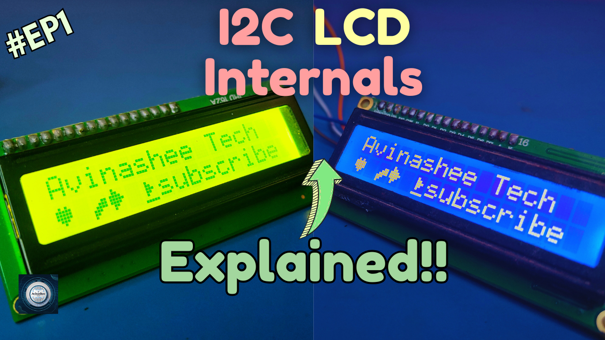
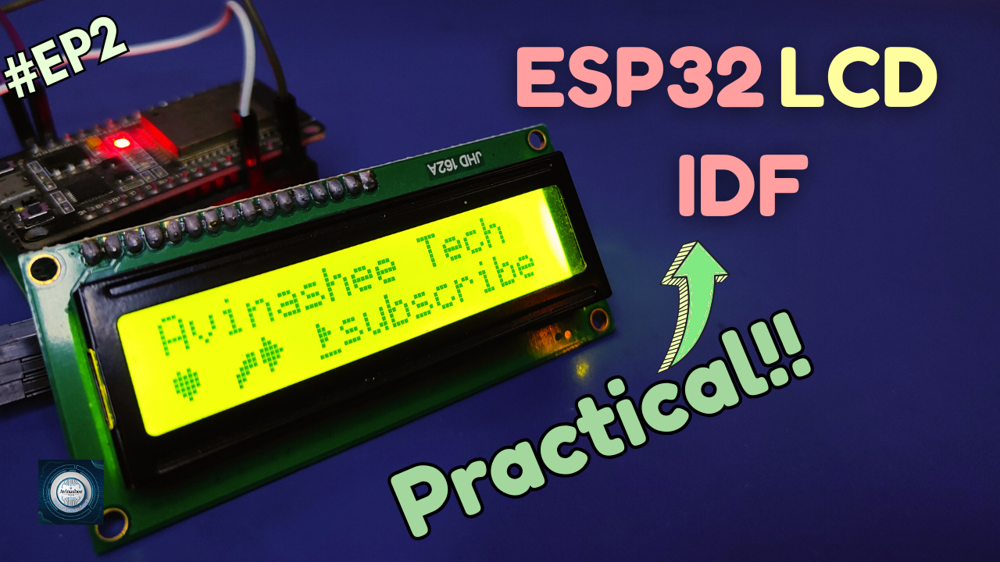
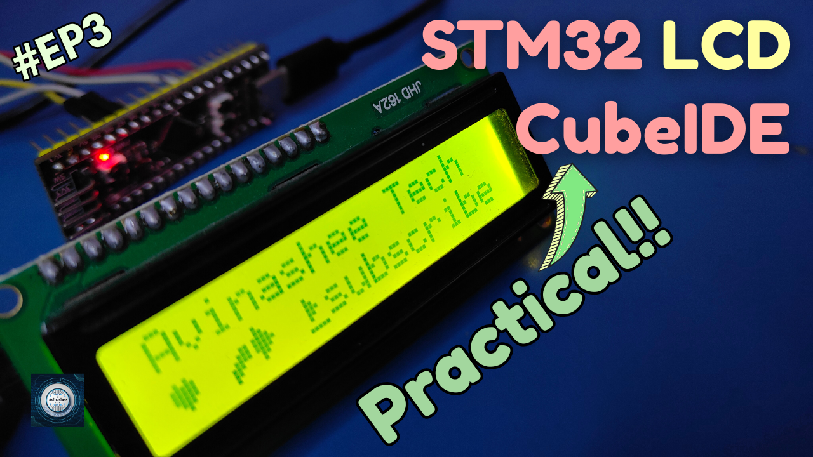

<h1 align="center">
  <a href="https://www.youtube.com/@eccentric_engineer">
	
  </a>  
</h1>

<h3 align="center">
	LCD Tutorial Series with ESP32 IDF and STM32 CubeIDE platforms
</h3>


  
## 📝 Overview

This repository supports tutorial series on interfacing HD44780-based 16x2 LCD displays using both ESP32 (ESP-IDF) and STM32 (CubeIDE) platforms. The series offers a deep-dive into the lcd controller and i/o expander datasheet, hands-on approach to LCD communication covering I2C via PCF8574 on both ESP32 and STM32 based controllers.

The code is designed for maximum reusability across platforms, with shared logic placed in a platform-independent driver (lcd_driver/) and platform-specific implementations abstracted cleanly.
  
Learn more 👇👇  
  
LCD Internals + Datasheet-Level Understanding Part 1 👇    
  
[](https://youtu.be/KTj_DRnFX4U)  

ESP32 Code Walkthrough & Demo Part 2 👇    
  
[](https://youtu.be/ZlrFt0dDOC8)  

STM32 Code Walkthrough & Demo Part 3 👇 
  
[](https://youtu.be/uYchTgKytXA)  

## ✔️ Requirements

### 📦 Hardware
- ESP32 Devkit V1 (main controller  board for ESP based project)
- USB Micro Cable
- STM32F411 Black Pill (main controller board for STM based project)
- USB C Cable
- 16x2 LCD Display
- PCF8574 I2C IO Expander

### 📂 Software
- VSCode (https://code.visualstudio.com/)  
- ESP-IDF (https://docs.espressif.com/projects/vscode-esp-idf-extension/en/latest/installation.html) (for ESP based Project)
- STM32CubeIDE (https://www.st.com/en/development-tools/stm32cubeide.html) (for STM based Project)

## 🛠️ Installation and usage

ESP32 👇  
```sh
git clone https://github.com/AvinasheeTech/LCD_Tutorial.git
Open ESP32_LCD folder in VSCode.
Go to ESP-IDF explorer icon in the left side panel -> Select Open ESP-IDF Terminal.
Enter the command 'idf.py build' to build the firmware.
Next connect ESP32 device to PC and confirm the COM port available.
Run the command 'idf.py -p PORT flash' where PORT is COMx with x being a number, to flash the firmware.
Once upload is complete, run command 'idf.py -p PORT monitor' to serially monitor firmware.
Enjoy...🍹
```  

STM32 👇  
```sh
git clone https://github.com/AvinasheeTech/LCD_Tutorial.git
Open STM32CubeIDE.
Go to option 'Open Projects from File System' and select STM32-LCD directory.
Go to Core/Src/main.c and press Ctrl+B shortcut to build it or use build button from toolbar.
Next connect ST-LinkV2 with your board.
Select Run or Debug icon and make sure that elf file is selected in respective configurations.
Once upload is complete, message is displayed on lcd.
Enjoy...🍹
```

## ⭐️ Show Your Support

If you find this helpful or interesting, please consider giving us a star on GitHub. Your support helps promote the project and lets others know that it's worth checking out. 

Thank you for your support! 🌟

[](https://github.com/AvinasheeTech/LCD_Tutorial/stargazers)
